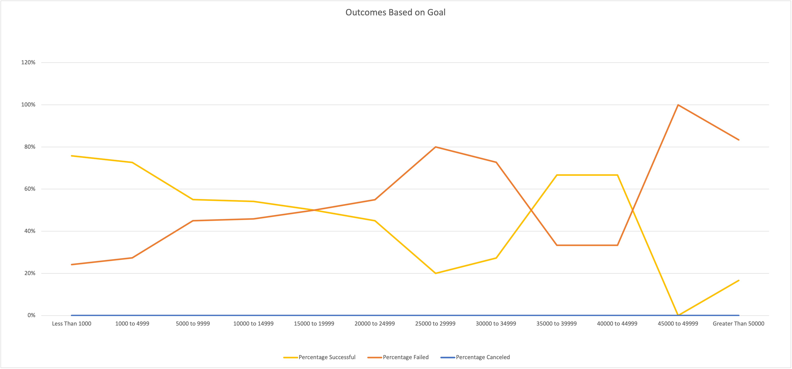
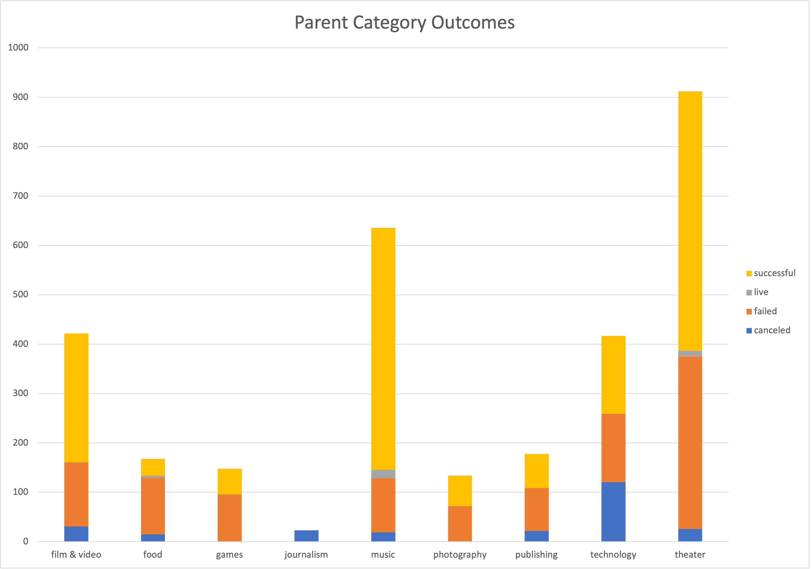

# Kickstarter - Analysis challenge in Excel
Performaning analysis on kickstarter data to uncover trends

# Overview of Project
This project is an assignmnet from Data Analytics program - Excel Module. It consists of two technical analysis deliverables. 
- Deliverable 1: Outcomes Based on Launch Date Chart 
- Deliverable 2: Outcomes Based on Goals Chart 
The purpose of this analysis is to determine if there is a specific factor that make a campaigns project successful. Understanding the campaign from start to finish so that the upcoming campaign can be set up to mirror other successful ones in the same categories. 

# Analysis and Challenges
- Use filters and Excel formula to create new datasets 
- Create visualizations using Excel charts and pivot tables 
- Interpret the summary data provided from the visualizations 
The most challenge part is to unstand the questions, knowing which data is needed to summarize and how it would present.
Testing and Googling helps a lot when working with privot table and formulas. 

# Theater Outcomes by Launch Date

Result: 
1.) May has the highest successful rate with over 100 and December has the lowest rate with less than 40. 
2.) Canceled rate has no relationship between months, successful and fail rate as it's very stable. 

# Outcomes Based on Goals

<u>Result: 
Based on this graph, you can see the percentage of the outcomes in each goal range. 
This graph could causes misleading and not efficient to read. 
For example, goal range of 45000 to 49999 has only 1 project in total sample size, and is a failed result, which shifted the graph with a 100% fail rate.
But that doesn't mean this goal range will always fail, as the sample size is too small to make an conclusion. 
In this case, an additional stacked column chart would be helpful to clearify sample size and the ratio of the outcomes. 

# Additional Outcomes Based on Goals

# Category statistic

